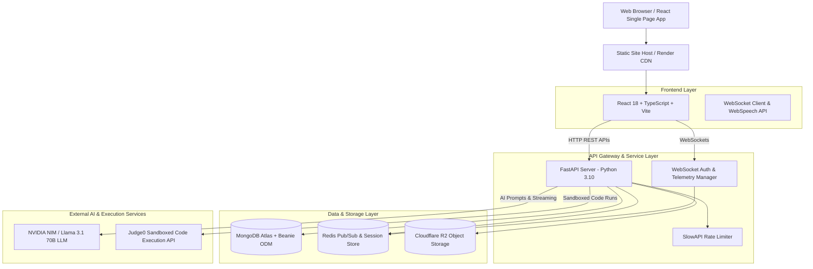
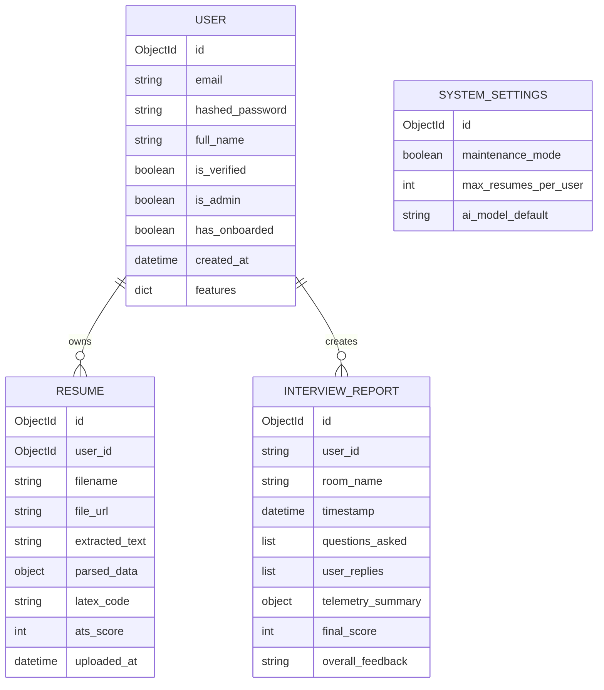

# SmartApply — Technical & Project Documentation

SmartApply is an end-to-end AI-powered career companion and job application platform. It combines automated resume tailoring, ATS compatibility scoring, real-time voice AI mock interviews with live code execution sandboxing, facial expression telemetry, project recommendations, and AI career coaching.

---

## Table of Contents
1. [Overview & Core Features](#1-overview--core-features)
2. [Target Audience](#2-target-audience)
3. [Estimated Userbase & Growth Projections](#3-estimated-userbase--growth-projections)
4. [System Architecture](#4-system-architecture)
5. [System Design & Component Workflows](#5-system-design--component-workflows)
6. [Data Models & Schema Reference](#6-data-models--schema-reference)
7. [Getting Started & Local Setup](#7-getting-started--local-setup)
8. [Deployment Architecture](#8-deployment-architecture)
9. [Future Scope & Roadmap](#9-future-scope--roadmap)

---

## 1. Overview & Core Features

SmartApply simplifies and elevates the modern job search workflow through automated AI tools:

* **🎯 AI Resume Tailor**: Automatically adapts user resumes for specific job descriptions, emphasizing relevant keywords and matching role requirements.
* **📊 ATS Compatibility Checker**: Scores resumes against job descriptions, calculating match percentages and identifying missing critical skills.
* **🎙️ Live Voice Interview Studio**: Interactive, voice-driven mock interviews with an AI recruiter featuring:
  * **Real-time WebSockets & Voice Synthesis**: Low-latency voice interaction.
  * **Judge0 Code Sandbox**: Live in-browser coding environment with sandboxed execution.
  * **Facial HUD Telemetry**: Real-time expression, eye contact, and confidence tracking via vision analytics.
  * **Comprehensive Interview Reports**: Detailed feedback on answers, technical accuracy, speech pacing, and areas for improvement.
* **💡 Idea Prompt Studio & Project Recommender**: Converts unstructured thoughts or skill sets into tailored portfolio projects and prompt guides.
* **💼 LinkedIn Optimizer**: Enhances LinkedIn profiles and headline summaries for recruiter visibility.
* **📄 Custom LaTeX Resume Builder**: Real-time LaTeX resume template rendering and PDF export.
* **⚙️ System Admin & Analytics**: Admin dashboard for monitoring API metrics, managing user permissions, and toggling system maintenance modes.

---

## 2. Target Audience

SmartApply is built for job seekers across various career stages:

1. **Software Engineers & Tech Professionals**:
   * Need automated ATS keyword alignment for technical roles.
   * Benefit from technical mock interviews with live coding sandboxes (Judge0).
2. **Recent College Graduates & Students**:
   * Need guidance on portfolio project ideas to showcase on their resumes.
   * Require interview practice to build confidence and articulate technical skills.
3. **Career Switchers**:
   * Need resume tailoring to highlight transferable skills when transitioning between industries.
4. **Mid-Level to Senior Job Seekers**:
   * Want to optimize multiple tailored resumes for different roles and monitor ATS compatibility scores.

---

## 3. Estimated Userbase & Growth Projections

### Phase 1: Launch & Initial Adoption (Months 1–6)
* **Active Users**: ~5,000 – 15,000 monthly active users (MAUs).
* **Primary Source**: Computer Science campus drives, tech job communities (Reddit, Discord, LinkedIn), bootcamps.
* **Usage Load**: ~50,000 resume checks/tailors per month; ~20,000 mock interview sessions.

### Phase 2: Scale & Community Growth (Months 6–18)
* **Active Users**: ~50,000 – 150,000 MAUs.
* **Expansion**: Partnership with university placement cells, bootcamps, and career coaching agencies.
* **Infrastructure Needs**: Distributed MongoDB cluster, dedicated Redis cluster, and scaled GPU/LLM inference endpoints.

### Phase 3: Global Enterprise / SaaS Scale (Year 2+)
* **Active Users**: 500,000+ MAUs.
* **Feature Expansion**: B2B recruiter dashboards, university placement tracking, and enterprise team licensing.

---

## 4. System Architecture

SmartApply utilizes a modern decoupled micro-service / full-stack architecture built for high concurrency, low latency, and real-time streaming:



---

## 5. System Design & Component Workflows

### A. Authentication & Session Synchronization
* **JWT Tokens & Real-time WebSockets**: Users authenticate via standard OAuth2 Bearer JWT tokens.
* **Multi-Tab Sync via Redis Pub/Sub**: When a user logs in, logs out, or verifies an OTP in one browser tab, `AuthSocketManager` broadcasts an auth event through Redis Pub/Sub to instantly update state across all open tabs.

### B. AI Resume Processing Pipeline
1. **Upload**: PDF/DOCX resumes are parsed using `PyPDF2` / `python-docx` and stored in Cloudflare R2 bucket storage.
2. **Extraction**: Raw text is cleaned and structured using Beanie document models.
3. **ATS Matching**: The backend sends the extracted resume text and target job description to NVIDIA NIM (Llama 3.1) with structured JSON schemas to compute match percentages, missing keywords, and specific improvements.

### C. Voice AI Mock Interview & HUD Telemetry System
1. **Room Initialization**: User starts a room; FastAPI initializes an interview state session.
2. **Voice Interaction**: The browser synthesizes questions and captures user voice responses using WebSpeech API.
3. **Live Code Execution**: Code submissions inside the interview studio are proxied to the Judge0 CE engine for sandboxed compilation and test execution.
4. **Telemetry Analytics**: Eye contact, confidence, and facial expressions are aggregated and compiled into a post-interview performance report (`InterviewReport`).

---

## 6. Data Models & Schema Reference

SmartApply uses **MongoDB** as its primary database, interfaced via **Beanie ODM** (Async Pydantic Object Document Mapper).



### Core Schemas:

#### 1. `User` Model (`users` collection)
```python
class User(Document):
    email: EmailStr
    hashed_password: str
    full_name: str
    is_verified: bool = False
    is_admin: bool = False
    has_onboarded: bool = False
    profile_pic_url: Optional[str] = None
    skills: List[str] = []
    education: List[EducationEntry] = []
    experience: List[ExperienceEntry] = []
    created_at: datetime
    features: dict[str, bool]
```

#### 2. `Resume` Model (`resumes` collection)
```python
class Resume(Document):
    user_id: PydanticObjectId
    filename: str
    file_url: str
    file_key: str
    extracted_text: str
    parsed_data: Optional[ResumeParsedData]
    latex_code: str
    html_code: str
    is_primary: bool = False
    ats_score: Optional[int] = None
    uploaded_at: datetime
```

#### 3. `InterviewReport` Model (`interview_reports` collection)
```python
class InterviewReport(Document):
    user_id: str
    room_name: str
    timestamp: datetime
    questions_asked: List[str]
    user_replies: List[str]
    areas_for_improvement: List[str]
    weaknesses: List[str]
    telemetry_summary: Dict
    final_score: int
    overall_feedback: str
```

#### 4. `SystemSettings` Model (`system_settings` collection)
```python
class SystemSettings(Document):
    maintenance_mode: bool = False
    max_resumes_per_user: int = 10
    ai_model_default: str = "meta/llama-3.1-70b-instruct"
    rate_limits: Dict[str, str]
```

---

## 7. Getting Started & Local Setup

### Prerequisites
* **Node.js**: v18.x or higher
* **Python**: v3.10 or higher
* **MongoDB**: Local MongoDB server or MongoDB Atlas URI
* **Redis**: Local Redis instance or Cloud Redis connection string

### Quick Start Guide

#### 1. Clone the Repository
```bash
git clone https://github.com/NandiVardhan2007/Smart-Apply.git
cd Smart-Apply
```

#### 2. Backend Setup
```bash
cd backend
python -m venv venv
# On Windows:
.\venv\Scripts\activate
# On Linux/macOS:
source venv/bin/activate

pip install -r requirements.txt
cp .env.example .env
# Fill in MONGODB_URI, REDIS_URL, NVIDIA_NIM_API_KEY in backend/.env

uvicorn app.main:app --reload --port 8000
```

#### 3. Frontend Setup
```bash
cd ../frontend
npm install
cp .env.example .env
# Ensure VITE_API_BASE_URL=http://localhost:8000 in frontend/.env

npm run dev
```
Open `http://localhost:5173` in your browser.

---

## 8. Deployment Architecture

SmartApply is pre-configured for continuous deployment via **Render** using [render.yaml](file:///d:/SMARTAPPLY/render.yaml):

* **Backend**: Deployed as a Python Web Service (`uvicorn app.main:app`).
* **Frontend**: Deployed as a Static Site (Vite output `dist`).
* **Redis**: Managed Redis instance connection.
* **Environment Configuration**: Set `VITE_API_BASE_URL` to point to the live backend domain.

---

## 9. Future Scope & Roadmap

1. **🤖 Multi-Modal AI Interviewers**: Integration of real-time avatar video synthesis for visual AI interviewers.
2. **🌐 Browser Extension for One-Click Tailoring**: Chrome extension to scrape job postings directly from LinkedIn/Indeed and tailor resumes on the fly.
3. **📊 Recruiter & University Portal**: B2B dashboard for career advisors to monitor student ATS preparation, interview scores, and placement readiness.
4. **💬 Mobile Application (React Native)**: Native iOS and Android mobile app for on-the-go interview prep and notifications.
5. **🔒 Offline Local Model Fallbacks**: Support for running smaller open-source LLMs (Ollama / Llama-3.2 3B) locally for privacy-conscious users.
