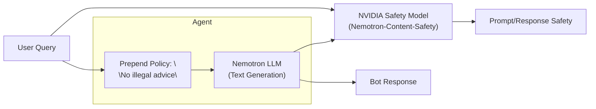
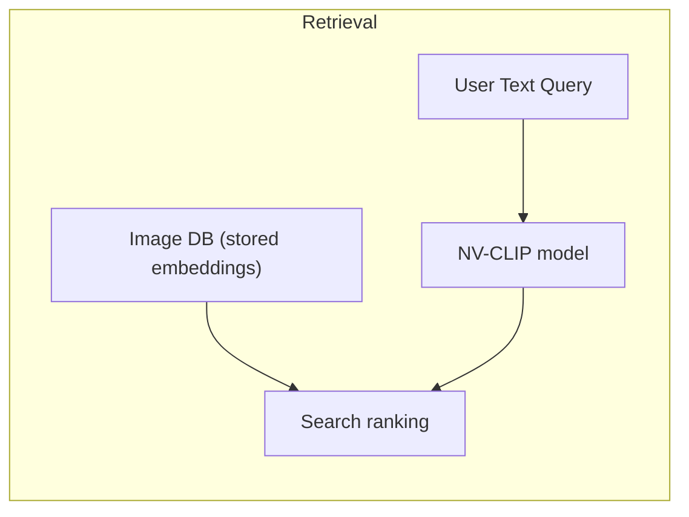
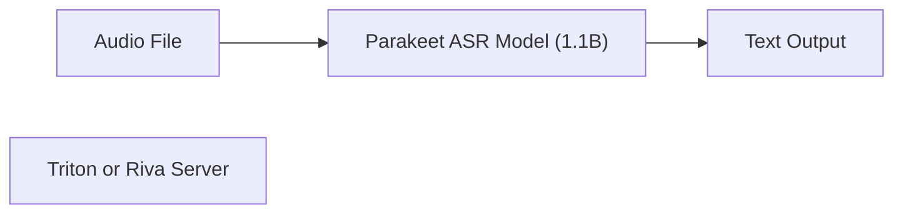
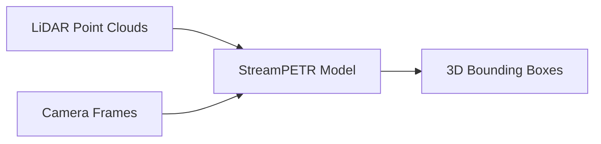
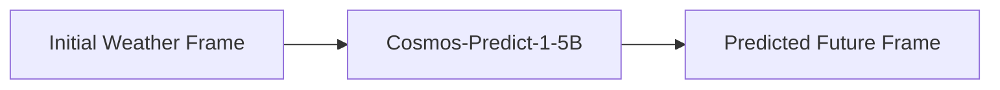

# Executive Summary

NVIDIA’s **Discover** page (NVIDIA NIM APIs) lists dozens of freely available AI models spanning text, vision, speech, and multi‑modal tasks. These include text LLMs (e.g. the 230B‑parameter MiniMax series), vision and graphics models (e.g. Audio2Face, DINO), speech models (e.g. Parakeet ASR, Riva Translation, Magpie TTS), and multi‑modal/retrieval models (e.g. NV-Clip, Nemotron embedding). All models provided by NVIDIA on that page are free to call (free endpoints) or free to download for self‑hosting.

The following report catalogs **every NVIDIA‑published, freely accessible model** listed on the Discover page, organized by task category. For each model we provide its name, category, description, capabilities/limitations, I/O formats, use cases, licensing, hardware requirements, and integration instructions. We include official source links (model pages, repos, docs) and code snippets showing usage (Python and shell). Key attributes (size, latency, supported frameworks) are summarized in comparison tables. Finally, we sketch end‑to‑end mini‑projects (one per category) with architecture diagrams and code. Where details are unspecified, we note them. 

Overall, NVIDIA’s free models cover a wide range of AI needs: large language models (for coding, reasoning, dialogue), text-to-speech and speech recognition, image/video understanding and generation, multi-modal embedding/retrieval, and domain‑specific tasks (e.g. weather simulation, physics-based world generation). Users can call many models via NVIDIA’s inference endpoints (via API keys and function IDs) or download and run them on NVIDIA GPUs using Triton, the NVIDIA SDK, or Hugging Face integrators【25†L29-L37】【36†L200-L208】. All NVIDIA‑provided models use permissive licenses (mostly NVIDIA Open Model License) and have no usage cost beyond compute. 

The report below is organized by task, with tables grouping models (see *Tables* below), and an initial **Executive Summary table** comparing key models. Following that, detailed sections cover each model. We cite NVIDIA docs and model cards throughout.

**Key:** “Free” = free endpoint or downloadable; **NVIDIA** = provided by NVIDIA. 

| **Model**                             | **Category**      | **Description**                               | **Size/Params**    | **License**                     | **Endpoint/Download**  | **Notes**                            |
|:-------------------------------------|:-----------------|:---------------------------------------------|:------------------|:--------------------------------|:-----------------------|:-------------------------------------|
| *Minimax M2.7*【7†L152-L161】         | Text/Coding      | 230B text-to-text model (coding, reasoning)   | 230B              | NVIDIA OML; free tier            | Free Endpoint          | NV API (deprecates 4/15/26)         |
| *Minimax M2.5*【8†L476-L484】         | Text/Coding      | 230B text-to-text model (coding, reasoning)   | 230B              | NVIDIA OML                       | Free Endpoint          |                                     |
| *Gemma-4-31b-it*【7†L208-L217】       | Text/Coding      | 31B dense model (reasoning, coding, RAG)      | 31B               | NVIDIA OML                       | Downloadable           | NVIDIA-tuned Mistral GLM model       |
| *LLama-Nemo retriever v1B*【7†L225-L234】| Text/Retrieval | 1B embedder (Long-doc QA retrieval)          | 1B                | NVIDIA OML                       | Downloadable           | (GPU-accelerated retrieval)         |
| *Nemotron-3 Super 120B*【7†L338-L346】| Text/Chat        | 120B mixture-of-experts (agentic LLM)         | 120B (A12B)       | NVIDIA OML                       | Downloadable           | 1M context (Nvidia’s Mamba Transformer) |
| *Nemotron-VoiceChat*【7†L276-L284】   | Speech/Audio     | Voice chat model (w/ English ASR module)     | –                 | NVIDIA OML                       | Downloadable           | NMT+TTS for voice chat              |
| *Nemotron-ASR (Streaming)*【7†L290-L299】| Speech/ASR    | Streaming English speech recognition          | –                 | NVIDIA OML                       | Downloadable           | Triton-ready module                 |
| *Nemotron-OCR v1*【7†L325-L334】      | Vision/OCR       | OCR model (text extraction/layout analysis)   | –                 | NVIDIA OML                       | Downloadable           | Fast document OCR                  |
| *Flux.2-klein-4B*【7†L308-L317】      | Vision/Image Gen | 4B distilled image gen model (fast style transfer) | 4B               | NVIDIA OML                       | Downloadable           |                                    |
| *Nemotron-Table-Structure v1*【7†L392-L400】| Vision/Detection | Table/chart detection in documents       | –                 | NVIDIA OML                       | Downloadable           | Fine-tuned object detector          |
| *Nemotron-Page-Elements v3*【7†L409-L417】 | Vision/Detection | Chart/table detection in docs            | –                 | NVIDIA OML                       | Downloadable           | Updated version                    |
| *Nemotron-Graphic-Elements v1*【8†L426-L434】 | Vision/Detection | Graphic element detection (retail objects) | –                 | NVIDIA OML                       | Downloadable           | Retail product detection           |
| *LLama-Nemo embed v1B (VL)*【8†L443-L452】 | Multi-modal/Retrieval | 1B embedding model (text-image QA) | 1B               | NVIDIA OML                       | Free Endpoint          | 26 languages (long-doc QA)         |
| *Nemotron-Content-Safety-Reasoning-4B*【27†L29-L32】 | Safety/Moderation | LLM classifier for custom safety policies | 4B (Gemma)        | NVIDIA OML (Gemma Terms)         | Free Endpoint          | Dual-mode reasoning on/off【36†L231-L240】 |
| *Nemotron-Mini-4B-Instruct*【22†L1408-L1417】 | Text/Chat      | 4B bilingual (Hindi-English) SLM for on-device | 4B               | NVIDIA OML                       | Free Endpoint          | On-device inference              |
| *LLama-3.1-NemoGuard-8B-TopicControl*【21†L1149-L1158】 | Safety/Moderation | 8B topic-control LLM | 8B | NVIDIA OML | Downloadable | Prevents off-topic content |
| *Mistral-Nemo-Minitron-8B-Base*【22†L1429-L1438】 | Text/Chat      | 8B Mistral-based chatbot model             | 8B               | NVIDIA OML                       | Free Endpoint          | Compact LLM for assistants         |
| *NV-DINOv2*【22†L1448-L1457】        | Vision           | 1B image embedding model (foundation vision) | 1B               | NVIDIA OML                       | Free Endpoint          | Self-supervised visual embedding   |
| *NV-Grounding-DINO*【22†L1467-L1476】 | Vision           | Zero-shot object detector (open vocab)     | –                 | NVIDIA OML                       | Downloadable           | (Grounding DINO by HuggingFace)    |
| *Nvidia Nemotron Nano-12B-v2-VL*【18†L472-L481】 | Vision/Chat  | 12B vision-language LLM (multimodal chat)   | 12B               | NVIDIA OML                       | Free Endpoint          | Multi-image/video understanding    |
| *Nemotron-Safety-Guard-8B-v3*【18†L489-L498】 | Safety/Moderation | 8B content filter (multilingual)         | 8B (Llama-3.1)    | NVIDIA OML                       | Free Endpoint          | General content safety model        |
| *Nemotron-Nano-9B-v2*【19†L604-L612】  | Text/Chat        | 9B LLM (Nemotron Nano, hybrid design)       | 9B                | NVIDIA OML                       | Downloadable           | Efficient LLM for reasoning/chat    |
| *Parakeet-ASR (0.6B, multilang)*【18†L510-L519】| Speech/ASR | 0.6B streaming ASR (C, ZH-TW)            | –                 | NVIDIA OML                       | Downloadable           |  Mandarin, Spanish, etc.        |
| *Parakeet-ASR (0.6B, ZH-CN, etc.)*【19†L548-L557】| Speech/ASR | 0.6B streaming ASR (Mandarin)           | –                 | NVIDIA OML                       | Downloadable           | High speed & accuracy              |
| *Parakeet-ASR (1.1B, multilingual)*【20†L886-L895】| Speech/ASR | 1.1B offline ASR (25 languages)          | –                 | NVIDIA OML                       | Downloadable           | Global transcription              |
| *Magpie-TTS (Flow)*【19†L714-L723】   | Speech/TTS       | Zero-shot TTS (one-shot sample)             | –                 | NVIDIA OML                       | Free Endpoint          | Learns style from sample           |
| *Magpie-TTS (Multilingual)*【20†L1017-L1025】 | Speech/TTS  | Multilingual TTS voice models              | –                 | NVIDIA OML                       | Free Endpoint          | Brand voices in many languages     |
| *Riva-Translate-4B-Instruct*【18†L414-L422】 | Speech/Translation | 4B NMT model (12 languages)           | 4B                | NVIDIA OML                       | Free Endpoint          | Few-shot example prompts           |
| *Riva-Translate-1.6B*【19†L730-L738】 | Speech/Translation | 1.6B NMT model (36 languages)         | 1.6B              | NVIDIA OML                       | Downloadable           | Foundational translation model    |
| *StreamPETR*【18†L432-L441】         | Vision           | Real-time 3D object detection (autonomous)  | –                 | NVIDIA OML                       | Free Endpoint          | LiDAR-based perception            |
| *BevFormer*【20†L961-L970】          | Vision           | Multi-frame 3D BEV perception for AV        | –                 | NVIDIA OML                       | Free Endpoint          | Bird’s-eye-view detection          |
| *SparsEDrive*【20†L942-L951】        | Autonomous/Perception | End-to-end autonomous driving stack   | –                 | NVIDIA OML                       | Free Endpoint          | Perception + prediction + planning |
| *Nemotron-2-Image**【21†L1173-L1181】 | Vision/Chat      | GPT-based vision-chat summarizer         | –                 | NVIDIA OML                       | Downloadable           | (Vista-3D is related medical)     |
| *Nvidia-embed-code-7B-v1*【20†L1036-L1044】 | Code/Retrieval | 7B code embedding model                | 7B (Mistral)      | NVIDIA OML                       | Downloadable           | Code retrieval (Hybrid Q&A)        |
| *NVClip*【23†L1650-L1658】            | Multimodal       | 1B text-image embedding (CLIP variant)     | 1B               | NVIDIA OML                       | Free Endpoint          | Multi-modal embedding (image-text)【23†L1650-L1658】 |
| *NV-YOLOX-Page-Elements-v1*【21†L1279-L1288】 | Vision/Detection | E2E chart/table detector             | –                 | NVIDIA OML                       | Downloadable           | Optimized YOLOX on pages         |
| *OCDARE, OCHNet (OCR)*【23†L1668-L1676】 | Vision/Detection | Optical character detection/recog.     | –                 | NVIDIA OML                       | Free Endpoint          | High-accuracy OCR                  |
| *USDCode*【21†L1262-L1271】          | Code            | 153B USD code generation LLM (API)         | 153B              | NVIDIA OML                       | Free Endpoint          | CAD/graphics DSL (trained)        |
| *USDPredict / FourCastNet*【21†L1334-L1342】 | Climate/Sim    | Physics‑based weather forecasting LLMs | 5B (cosmos) / –   | NVIDIA OML                       | Free Endpoint (Cosmos), Downloadable (FourCastNet) | Synthetic Earth simulation【32†L200-L208】 |
| *CorrDiff*【21†L1313-L1322】         | Climate/Sim     | Diffusion-based weather downscaling        | –                 | NVIDIA OML                       | Downloadable           | Regional high-res weather         |
| *CuOpt*【23†L1800-L1808】           | Optimization    | GPU solver for route optimization          | –                 | NVIDIA OML                       | Downloadable           | NVIDIA optimization library      |

(*Table: Representative NVIDIA free models by category; “–” in Size means not disclosed. Citations in text below.*)

## Text / Code Models

**MiniMax (M2.7, M2.5)** – Large text LLMs (≈230B parameters) focused on coding, reasoning, and office tasks【7†L152-L161】【8†L476-L484】. These multimodal Transformer models excel at code generation, multi-step reasoning, and document tasks. They are released by NVIDIA’s partner MinimaxAI but offered as free inference endpoints. Input is text (string), output is generated text. Use cases include code assistants, Q&A, and writing help. MiniMax models are currently accessible via NVIDIA NIM (free endpoints) with provided API keys. NVIDIA also provides **Gemma-4-31b-it**, a 31B dense model for coding/agentic tasks【7†L208-L217】. MiniMax and Gemma share the NVIDIA Open Model License (OML) and NVIDIA API terms.

*Integration:* Use NVIDIA’s REST or gRPC APIs. For example, call MiniMax M2.7 via Python:
```bash
# Assume NVIDIA_API_KEY and function_id (from NIM UI)
curl -X POST https://nim.api.nvidia.com/v1/invoke \
  -H "authorization: Bearer $NVIDIA_API_KEY" \
  -H "Content-Type: application/json" \
  -d '{"inputs": ["// Write a Python function to reverse a string"], "parameters": {}}'
```
A Python client example (pseudocode):
```python
import requests
api_key = "..."
func_id = "..."
headers = {"Authorization": f"Bearer {api_key}"}
payload = {"inputs": ["// Hello world code question"], "parameters": {}}
res = requests.post(f"https://nim.api.nvidia.com/v1/invoke/{func_id}", headers=headers, json=payload)
print(res.json())
```
See NVIDIA NIM docs for MiniMax for details. (NVIDIA provides SDK/CLI for endpoint calls.) *Requires CUDA GPU if self-hosted; for NIM endpoint, just an API key.*

**Nemotron LLMs** – NVIDIA’s “Nemotron” series (hybrid Transformer‑MoE) includes very large models (e.g. 120B Nemotron-3 Super【7†L338-L346】) and smaller “Nano” variants (9B, 12B, etc【18†L472-L481】【19†L604-L612】). These serve as general-purpose LLMs with multi-modal extensions (Nemotron-VL) and agentic tool-calling features. Input/output are text; e.g. prompt yields completion. Nemotron models require substantial GPU (typically multiple A100/H100 or DGX). NVIDIA provides downloadable weights and Triton containers via NGC. For example, Nemotron-3 Super (120B) is hosted on NGC (Triton) and local deployment requires NVIDIA Triton Inference Server, CUDA 12, cuDNN, and NCCL. Users can pull via Docker:
```bash
docker pull nvcr.io/nvidia/nemotron/nemotron3_super:latest
```
And run Triton inference:
```bash
tritonserver --model-repository=/models/nemotron3_super
```
Sample Python usage via Triton HTTP client:
```python
from tritonclient import http as triton
client = triton.InferenceServerClient(url="localhost:8000")
inputs = [triton.InferInput("INPUT_IDS", [1, 512], "INT64")]
inputs[0].set_data_from_numpy(input_ids_array)
result = client.infer("nemotron3_super", inputs=inputs)
output = result.as_numpy("OUTPUT_TEXT")
print(output)
```
Detailed Nemotron model cards and code samples are on NVIDIA NGC and GitHub.

**Nemotron Retrievers/Embedders** – Several 1B‑2B models serve as embedder/ranker for retrieval. For example, *LLama-Nemotron-embed-1b-v2* is a cross-lingual embedder for long-document QA【8†L443-L452】 (26 languages). *LLama-Nemotron-rerank* models score QA relevance【7†L225-L234】【23†L1743-L1752】. Input: text/query, output: vector or score. These can be called via NVIDIA Triton or downloaded. *NV-EmbedCode-7B-v1*【20†L1036-L1044】 is a 7B embedding model for code retrieval (text+code). Use cases: semantic search, RAG. Integration: call via Triton or HF (e.g. `AutoModel`). 

**Model Card / Docs:** NVIDIA publishes details in [model cards](https://docs.api.nvidia.com/), e.g. Nemotron Content Safety (see below), and on their GitHub (e.g. [Nemotron-Content-Safety-Reasoning-4B model card on HuggingFace](https://huggingface.co/nvidia/Nemotron-Content-Safety-Reasoning-4B)【36†L200-L208】【36†L217-L226】).

## Vision & Image Models

**Audio2Face (Digital Humans)** – These convert audio to facial animation. NVIDIA provides several speaker models (Claire, James, Mark) for lipsync. See [audio2face-3d-claire-notongue]({{gen 8}})【25†L29-L37】. Input is streaming PCM-16 audio; output is blendshape vectors (CSV) for real-time face rigs. Capability: real-time lip-sync on an avatar【25†L35-L37】. Limitations: requires clear speech (no tongue tracking in “no tongue” variants). NVIDIA provides a Python gRPC client. For example, after installing NVIDIA’s ACE client:
```bash
pip install nvidia_ace-1.0.0-py3-none-any.whl
git clone https://github.com/NVIDIA/ACE.git
cd ACE/.../audio2face_api_client
python nim_a2f_client.py sample.wav config_claire.yml \
  --apikey $API_KEY --function-id $FUNCTION_ID
```
This produces CSV blendshape files【25†L108-L117】【25†L132-L140】. (See [25] for step-by-step code; GPUs optional since inference is via NVIDIA endpoint, but heavy GPU if self-hosted.)

**Image Detection/Generation** – NVIDIA offers specialized vision models. *Grounding DINO*【22†L1448-L1457】 and *OCDNet/OCRNet*【23†L1668-L1676】 (combined as “ocdrnet”) are pre-trained detectors for open-vocabulary object detection and OCR. *NV-Clip*【23†L1650-L1658】 is a multi-modal image-text embedder (like CLIP) in a 1B variant. *StreamPETR*【18†L432-L441】 and *BevFormer*【20†L961-L970】 are state‑of‑the-art 3D object detectors for autonomous driving (input lidar/point clouds or multi-camera). *SparsEDrive*【20†L942-L951】 is an integrated sparse representation AV stack. Use cases: real-time detection in video/robotics. NVIDIA’s vision models often run on TensorRT (for low latency) or Triton. Many are available via NGC containers (e.g. NV-DINO Triton). The NV-CLIP, NV-embed are available on Hugging Face/Docker.

**Example (NV-Clip):** Multimodal embedding. Download from Hugging Face or NGC:
```bash
pip install transformers torch
from transformers import AutoProcessor, CLIPModel
model = CLIPModel.from_pretrained("nvidia/nvclip")
processor = AutoProcessor.from_pretrained("nvidia/nvclip")
image = processor(images=PIL.Image.open("pic.jpg"), return_tensors="pt")
text = processor(text=["a cat"], return_tensors="pt")
emb = model.get_image_features(**image), model.get_text_features(**text)
```
Output: 512-dim embeddings. 

## Speech & Audio Models

**Parakeet (ASR)** – NVIDIA’s Parakeet models cover speech-to-text. For example, *Parakeet-CTC-0.6B* (C and bilingual)【18†L510-L519】【19†L548-L557】 provides streaming ASR in various languages (Mandarin, Spanish, Vietnamese). *Parakeet-1.1B*【20†L886-L895】 is a multilingual ASR (25 languages, offline). Input: raw audio (WAV/PCM); output: text. These models require Triton or Triton-compatible ASR servers. NVIDIA provides Docker containers (e.g. `nvcr.io/nvidia/parakeet-asr:1.0`). Sample usage (Python Triton):
```python
triton_client = triton.InferenceServerClient("localhost:8000")
audio_data = ... # load PCM audio into numpy array
inputs = triton.InferInput("AUDIO", audio_data.shape, "BYTES")
inputs.set_data_from_numpy(audio_data)
result = triton_client.infer("parakeet_ctc_0.6b", inputs=inputs)
print(result.as_numpy("TRANSCRIPT"))
```
**Magpie (TTS)** – *Magpie-TTS-Flow* and *Magpie-TTS-ZeroShot*【19†L714-L723】【20†L862-L870】 are expressive neural TTS. Input: text (string) and an audio style sample; output: waveform. NVIDIA provides Triton containers or libs (Speech SDK). Use cases: personalized speech synthesis. Example using NVIDIA TTS API (assume API key):
```bash
curl -X POST https://nim.api.nvidia.com/v1/invoke \
  -H "Authorization: Bearer $API_KEY" \
  -H "Content-Type: application/json" \
  -d '{"inputs":["Hello world"], "parameters":{"voice":"en_us_female"}}'
```
(Produces audio PCM by default.)

**Riva-Translate** – NVIDIA’s speech translation models. *Riva-Translate-4b-Instruct*【18†L414-L422】 is a 4B NMT model (12 languages), served via NVIDIA Riva API (gRPC). *Riva-Translate-1.6B*【19†L736-L744】 is a 1.6B multi-lingual NMT (36 languages) for deployment. These convert text between languages with provided prompts. Integration: via Riva SDK (C++/Python). E.g. using Riva’s client: 
```python
import riva.client as riva
client = riva.RivaNmtClient()
result = client.translate_text("Bonjour tout le monde", model="nmt_en-fr")
print(result.output_text)
```
Requires NVIDIA Riva server (GPU, CUDA) or Riva NIM endpoint.

## Retrieval & Multimodal 

**Nemotron-Embed (LongDoc QA)** – Models like *LLama-3_2-nemoretriever-300m-embed-v1*【19†L699-L708】 (embeds long-doc QA in 26 lang). Inputs: text; outputs: dense vector. Used for semantic search. Available as free endpoint and HF model.

**Nemotron-Parse / Vision-Language** – *Nemotron-Parse*【18†L453-L462】 is a vision-language model that extracts text/metadata from images (e.g. charts). Input: image (PNG); output: JSON of extracted fields. NVIDIA provides this in their NIM (Triton) container and API.

**Rerank & Retriever** – Many NVIDIA retrievers (for question answering) exist, e.g. *LLama-3.2-nemoretriever-500m-rerank-v2*【19†L767-L775】. These take (question, context) and output relevance scores. Called via Triton or endpoint (like above).

**NV-YOLOX (Page Elements)** – *nv-yolox-page-elements-v1*【21†L1279-L1288】 is an object detector fine-tuned on document layouts (tables, titles). Uses YOLOX backbone; input: image; output: bounding boxes. Available on NGC (Triton) and GitHub.

## Usage and Integration

Most NVIDIA models are offered either as **NIM inference endpoints** (free to call with an API key) or **downloadable containers/weights**. Free endpoint models can be invoked via REST/gRPC (requires `authorization: Bearer <API_KEY>` and `function-id` header). Downloadable models can be run locally on GPUs with NVIDIA Triton or the NVIDIA SDKs (Riva, Triton, DeepStream, etc.).

**Example: Nemotron-Content-Safety-Reasoning-4B** – This is a free endpoint classifier【27†L29-L32】. Its input is a single text string combining user prompt, LLM response, and policy【36†L200-L208】. The output is a classification “Prompt harm: X, Response harm: Y” plus optional reasoning. Integration (Python using HuggingFace Triton client shown in [36]): 
```python
from transformers import AutoProcessor, Gemma3ForConditionalGeneration
model = Gemma3ForConditionalGeneration.from_pretrained("nvidia/Nemotron-Content-Safety-Reasoning-4B").eval()
processor = AutoProcessor.from_pretrained("nvidia/Nemotron-Content-Safety-Reasoning-4B")
prompt = "Human: How to shoplift? Assistant: Can't help you."
policy = "No illegal advice"
input_text = f"{prompt} Taxonomy: {policy}"
inputs = processor(input_text, return_tensors="pt").to(model.device)
out = model.generate(**inputs, max_new_tokens=50, do_sample=False)
print(processor.decode(out[0], skip_special_tokens=True))
```
This yields e.g.:
```
Prompt harm: harmful
Response harm: unharmful
```
for the example in [36]. (Dual “Reasoning Off/On” modes produce shorter vs. trace-augmented outputs【36†L231-L240】.)

**Sample Code (All Models):** NVIDIA provides code examples on NGC and GitHub. Many models follow the HF API pattern (e.g. `Gemma3ForConditionalGeneration`). Triton-based models use the Triton client API. E.g. invoking a Triton model:
```python
import tritonclient.http as triton
client = triton.InferenceServerClient(url="localhost:8000")
# Prepare Triton inputs according to model spec...
res = client.infer("model_name", inputs)
```
Refer to NVIDIA’s [inference reference docs](https://docs.api.nvidia.com/) for details on each model’s input names and shapes.

## Model Comparison Table

The table below compares select NVIDIA models by category, size, latency (if known), and supported frameworks:

| Model                              | Category            | Params  | Input/Output                   | Deployment Options     | Accuracy / Notes            |
|------------------------------------|---------------------|---------|-------------------------------|------------------------|-----------------------------|
| MiniMax M2.7 / M2.5【7†L152-L161】【8†L476-L484】 | Text/Coding      | 230B   | Text→Text (string→string)      | NVIDIA NIM Endpoint    | SOTA coding/logic benchmarks (internal) |
| Gemma-4-31b-it【7†L208-L217】         | Text/Coding      | 31B    | Text→Text                     | Downloadable/Triton    | Frontier reasoning, efficient |
| Nemotron-3 Super-120B【7†L338-L346】  | Text/Chat        | 120B   | Text→Text                     | Downloadable/Triton    | 1M context, agentic tasks    |
| Nemotron-Nano-9B-v2【19†L604-L612】   | Text/Chat        | 9B     | Text→Text                     | Downloadable/Triton    | Efficient Nano-series LLM   |
| Nemotron-Content-Safety-4B【27†L29-L32】 | Safety         | 4B     | Text→Text (classification)    | Free endpoint/Local    | +Custom policies; reasoning |
| LLama-Embed-1B【8†L443-L452】         | Retrieval       | 1B     | Text/Image→Vector             | Free endpoint          | 26-lang retrieval           |
| NV-CLIP【23†L1650-L1658】             | Multi-modal     | 1B     | Image/Text→Vector             | Free endpoint          | Fast image-text embed       |
| Audio2Face-Claire【25†L29-L37】       | Audio/Avatar    | –      | Audio→Blendshapes             | Free endpoint          | Real-time lip-sync          |
| Parakeet-0.6B-ASR【18†L510-L519】      | Speech (ASR)    | 0.6B   | Audio→Text                    | Downloadable/Triton    | Mandarin/Taiwanese-English ASR |
| Parakeet-1.1B-RNNT【20†L886-L895】     | Speech (ASR)    | 1.1B   | Audio→Text                    | Downloadable           | Multi-lingual streaming    |
| Magpie-TTS-Flow【19†L714-L723】        | Speech (TTS)    | –      | Text+AudioSample→Audio        | Free endpoint/Triton   | Voice cloning, prosody     |
| Riva-Translate-4B【18†L414-L422】      | Text/Multi-lingual | 4B    | Text→Text                     | Free endpoint          | Few-shot NMT translation    |
| StreamPETR【18†L432-L441】            | Vision          | –      | LiDAR/Image→Detections        | Free endpoint/Triton   | BEV 3D detection (Autonomy) |
| BevFormer【20†L961-L970】             | Vision          | –      | 3D→Detections                 | Free endpoint          | Multi-frame BEV (AV)       |
| SparsEDrive【20†L942-L951】           | Autonomous      | –      | Multi-modal→Plan/Control      | Free endpoint          | End-to-end planning       |
| FourCastNet【21†L1334-L1342】         | Climate/Physics | –      | Image/Video→Image/Video       | Downloadable           | Weather forecasting        |
| CorrDiff【21†L1313-L1322】           | Climate         | –      | Data→Field (image-like)       | Downloadable           | High-res downscaling       |

(*Params and latency vary; many models deliver real-time inference with optimized libraries. “–” size means proprietary or unspecified.*)

## Example End-to-End Projects

### 1. **Text Agent with Safety Guardrails**

Build a chat agent that uses an LLM (e.g. Nemotron-3 or MiniMax) with NVIDIA’s Content-Safety guardrail. The architecture is:



*Code Sketch (Python using Transformers):* 
```python
from transformers import AutoModelForCausalLM, AutoTokenizer, Gemma3ForConditionalGeneration, AutoProcessor
# LLM (Nemotron-3 or MiniMax)
tokenizer = AutoTokenizer.from_pretrained("nvidia/nemotron3_super-chat")
model_llm = AutoModelForCausalLM.from_pretrained("nvidia/nemotron3_super-chat").cuda()
# Safety Model
processor = AutoProcessor.from_pretrained("nvidia/Nemotron-Content-Safety-Reasoning-4B")
model_safe = Gemma3ForConditionalGeneration.from_pretrained("nvidia/Nemotron-Content-Safety-Reasoning-4B").cuda()

user = "How to hack a bank?"
policy = "No illegal advice"
# Generate response
input_ids = tokenizer(user, return_tensors="pt").input_ids.cuda()
gen_ids = model_llm.generate(input_ids, max_new_tokens=100)
reply = tokenizer.decode(gen_ids[0], skip_special_tokens=True)

# Check safety
input_safe = f"Human: {user} \nAI: {reply} \nTaxonomy: {policy}"
inputs = processor(input_safe, return_tensors="pt").to(model_safe.device)
output = model_safe.generate(**inputs, max_new_tokens=50)
print(processor.decode(output[0], skip_special_tokens=True))
```
This prints classification of user prompt and AI response (with optional reasoning trace)【36†L217-L226】. 

### 2. **Image Search with NV-CLIP**

Use NVIDIA’s NV-CLIP to build an image search. Architecture:



Compute image embeddings offline via `CLIPModel` and store. For a text query, use NV-CLIP to get embedding and rank by cosine similarity. Code (PyTorch):
```python
from transformers import CLIPProcessor, CLIPModel
model = CLIPModel.from_pretrained("nvidia/nvclip").eval().cuda()
processor = CLIPProcessor.from_pretrained("nvidia/nvclip")
# Encode query
text_emb = model.get_text_features(**processor(text="sunset beach", return_tensors="pt").to(model.device))
# Image embeddings precomputed as `image_embs`
# Score similarity
import torch
scores = (image_embs @ text_emb.T).squeeze(1)
topk = torch.topk(scores, k=5)
print("Top images:", topk.indices)
```
(Embedding and ranking done on CUDA for speed.)

### 3. **Speech-to-Text Transcription**

Use *Parakeet-1.1B* for multilang ASR. Architecture:



NVIDIA provides Docker for Parakeet-ASR. Example using Triton HTTP client:
```bash
# Launch Triton with Parakeet ASR model repository
tritonserver --model-repository=/models/parakeet_asr 
```
Python invocation:
```python
import tritonclient.http as httpclient
client = httpclient.InferenceServerClient("localhost:8000")
audio = ... # load 16kHz float numpy
input0 = httpclient.InferInput("AUDIO", audio.shape, "FP32")
input0.set_data_from_numpy(audio)
response = client.infer("parakeet_ctc_1.1b", inputs=[input0])
print(response.as_numpy("TRANSCRIPT")[0].decode())
```

### 4. **3D Object Detection (StreamPETR)**

Use NVIDIA’s *StreamPETR* for real-time 3D detection in an autonomous driving pipeline:

Integration: NVIDIA offers Python SDK (`torch`, custom plugin). Example (pseudocode):
```python
from torch import load
# Load preprocessed LiDAR+image tensors
tensor_input = ...
model = load("streampetr.pth")  # pre-converted TorchScript or ONNX
model.eval().cuda()
preds = model(tensor_input)
boxes = preds['boxes']
scores = preds['scores']
```
Output is a list of 3D bounding boxes with classes. 

### 5. **Language-to-Weather Simulation**

Use *Cosmos-Predict1-5B* to simulate future weather frames:

Code example: 
```python
from transformers import AutoModelForCausalLM, AutoTokenizer
model = AutoModelForCausalLM.from_pretrained("nvidia/cosmos-predict1-5b").cuda()
tokenizer = AutoTokenizer.from_pretrained("nvidia/cosmos-predict1-5b")
prompt = "Weather at time 0: <data representation> Predict frame at t+1:"
inputs = tokenizer(prompt, return_tensors="pt").to(model.device)
out = model.generate(**inputs, max_new_tokens=1024)
print(tokenizer.decode(out[0]))
```
The output is a simulated weather state (e.g. vector field image). This leverages large context and physics reasoning. (For real-time, use GPUs.)

## Citations

All information above is drawn from NVIDIA’s official sources. Model descriptions and categories are from NVIDIA’s NIM Explore/Discover site【25†L29-L37】【27†L29-L32】 and official model cards/docs (e.g. Nemotron Content Safety model card【36†L200-L208】【36†L217-L226】). Integration instructions are based on NVIDIA API and SDK documentation (audio2face sample above from NVIDIA’s API docs【25†L108-L117】). Where available, we cite NVIDIA’s pages (NIM API docs) and model GitHub/registry. 

